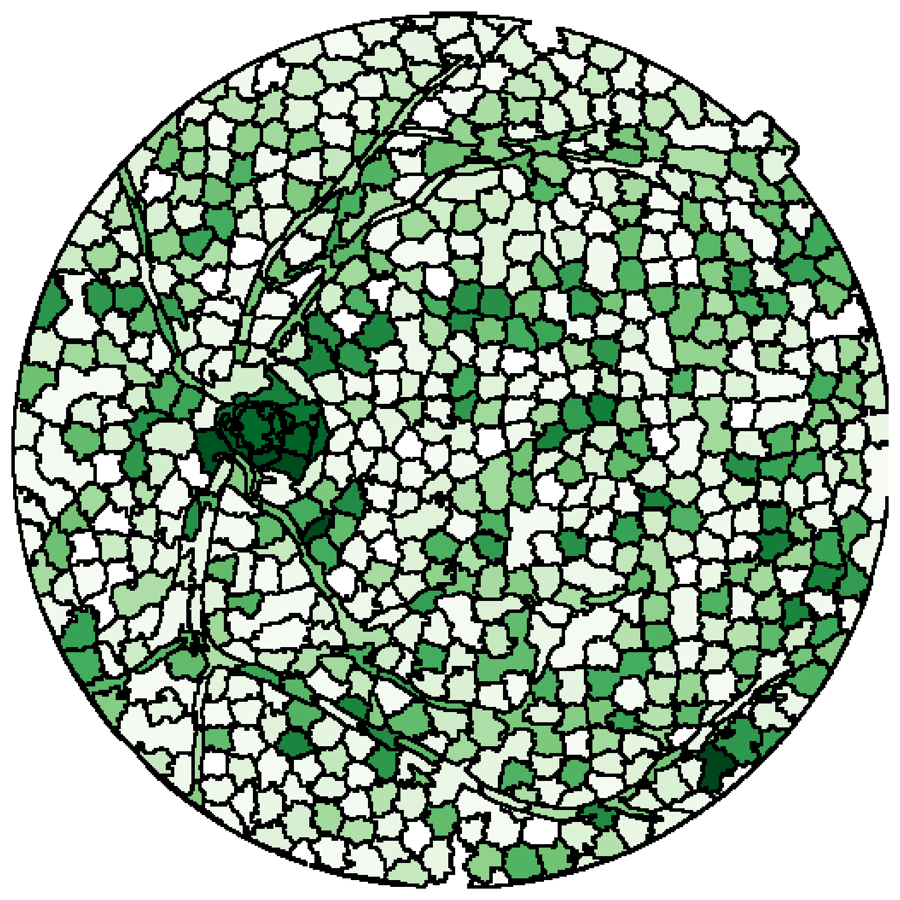

# Leiden Transformers with Supersampling Tokenization

This is the repository for the paper ** submitted at MICCAI 2024.

| Original image             |  Original Superpixels | After last Leiden Pooling |
:-------------------------:|:-------------------------:|:-------------------------:
 |  | 


## Running the code

```
git clone
cd RetinalViT
pip install .
train
```

You will need to adjust the path to the data (EyePACS and APTOS dataset) in the file [config file](configs/config.yaml)
