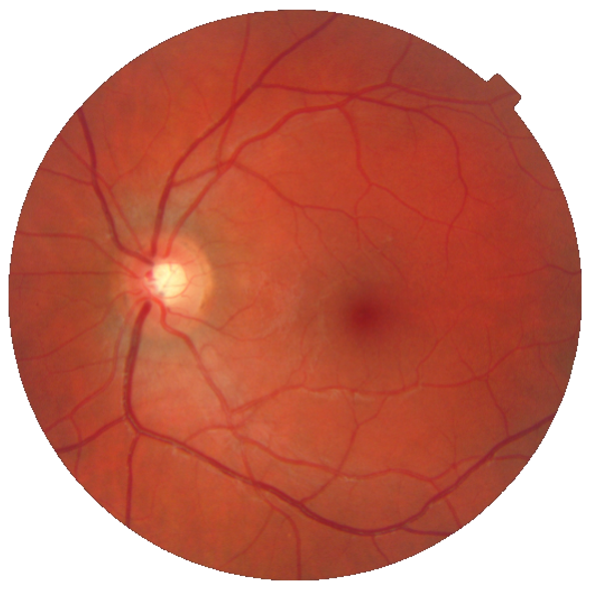

# Leiden Transformers with Supersampling Tokenization

This is the repository for the paper ** submitted at MICCAI 2024.


# Contributions

## Leiden Pooling between Transformer Layers
| Original image             |  Original Superpixels | After last Leiden Pooling |
:-------------------------:|:-------------------------:|:-------------------------:
 |  | 


## Running the code

```
git clone
cd RetinalViT
pip install .
train
```

You will need to adjust the path to the data (EyePACS and APTOS dataset) in the file [config file](configs/config.yaml).

### Distributed training and Fast SLIC

We rely on [Fast-SLIC](https://github.com/Algy/fast-slic) to compute the superpixels in the datasets. Unfortunately, in distributed training (multi-GPUs), fast-SLIC crashes when num_threads>1.

### CUDA implementation of Leiden algorithm

We use [RAPIDS cugraph](https://github.com/rapidsai/cugraph/tree/main) for running the Leiden Algorithm. Note that may need to manually install [CUDA](https://developer.nvidia.com/cuda-toolkit).

We rely on [DLPack](https://github.com/dmlc/dlpack) for an efficient transfer of tensors between PyTorch and cugraph (see our [code](src/vitRet/models/prototypes_vit/cluster/cluster.py) for details).